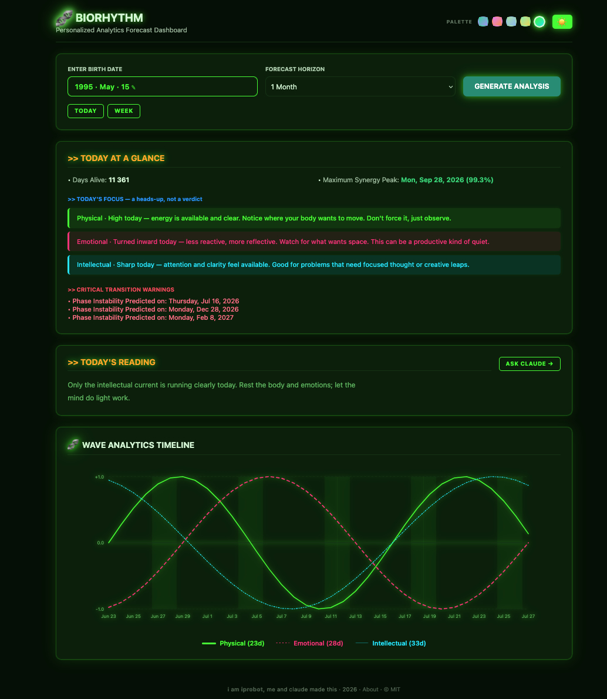

# 🧬 BIORHYTHM

A single-file, zero-dependency biorhythm dashboard built with vanilla HTML, CSS, and JavaScript.

---

## What it is

Biorhythm theory holds that humans move through three overlapping sine-wave cycles from birth — Physical (23 days), Emotional (28 days), and Intellectual (33 days). This tool plots those waves, summarises where you stand today, and offers a quiet daily reading to prompt self-reflection.

It does not claim the cycles are scientifically valid. It claims something simpler: that pausing once a day to ask *"where am I?"* is useful — and a sine wave is a surprisingly good prompt for that question.

---

## Features

- Enter your birth date → instant chart across 1 / 3 / 6 / 12 months
- Today's Reading — a single synthesised mentor sentence from a 27-combination matrix (Physical × Emotional × Intellectual)
- Ask Claude → button (when online) opens claude.ai with your biorhythm prompt pre-copied
- Zoom and pan the chart with mouse wheel + drag
- Today / Week snap buttons
- 5 colour palettes (Cosmos · Dusk · Nordic · Ember · Neon) × dark / light theme
- Critical transition day warnings
- About modal with the philosophy behind the tool
- MIT licensed · no build step · no dependencies · no tracking

---

## Usage

Download `index.html` and open it in any modern browser. That's it.

---

## Philosophy

Biorhythms belong to a long tradition of shaman tools — tarot, I Ching, astrology, psychotherapy — that share a common mechanism: a structured symbolic prompt that focuses attention and creates a contemplative space. The reading does not tell you the truth. It creates conditions in which you notice what is already present.

> *"You are giving your subconscious a structured prompt. The chart shows a high, a low, a crossing. You notice. You let that awareness land — and consciousness sharpens around it. That is enough."*

---

## Made by

[iprobot](https://iprobot.com) × Claude · 2026 · MIT License
